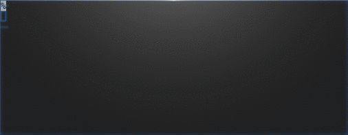

# go-progress

A Go library to display progression in console tool. Provides unicode themes with a really simple API.



## Usage

To use, create a new bar with the total, and call the Set() func to update the value, and you are done.

```go
bar := progress.New(100)

//Choose your style!
bar.Format = progress.ProgressFormats[4]

for bar.Inc() {
	time.Sleep(time.Millisecond * 20)
}
```

## License

go-progress is released under the MIT License. See [LICENSE](https://github.com/raoulh/go-progress/blob/master/LICENSE).
